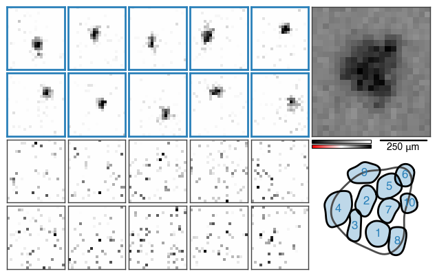

Advanced plotting
=================

Visualization of the STNMF results is highly customizable.
By default, :meth:`STNMF.plot() <stnmf.STNMF.plot>` produces a figure of the following form.
See :doc:`../guides/examples` for step-by-step instructions on how to create this figure.

Quick customizations
--------------------

Continuing with this example figure, here is an incomplete list of selected customizations.

1. Simplified figure
^^^^^^^^^^^^^^^^^^^^

If the information in the figure is overwhelming, the subplots in the bottom (weights and autocorrelation) can be omitted by setting the parameter `full` to `False` in :meth:`STNMF.plot() <stnmf.STNMF.plot>`

.. code-block:: python

    >>> stnmf.plot(full=False)

2. Flipped sign
^^^^^^^^^^^^^^^

By default, the sign of the pixel values of the modules is flipped such that the average weights are positive.
This explains both positive and negative values (red and black) in the above figure, despite the fact that the modules are subject to non-negativity.
This is achieved with :meth:`STNMF.flipsign() <stnmf.STNMF.flipsign>` or the construction parameter `flipsign` in :meth:`STNMF.__init__() <stnmf.STNMF.__init__>`.
Without the flipped sign, the resulting figure displays all modules with positive sign, regardless of the polarity of the cell.

.. code-block:: python

    >>> stnmf_no_flip = STNMF(ste, sparsity=1.74, pixel_size=30, flipsign=False)
    >>> stnmf_no_flip.plot(full=False)

3. Color coding
^^^^^^^^^^^^^^^

For instance, the color coding of the subunits can be adjusted.
Instead of a color series, a single color can be applied for easy visual discrimination between localized and non-localized modules.
The colors can be controlled using the parameter `color` in :meth:`STNMF.plot() <stnmf.STNMF.plot>`.

.. code-block:: python

    >>> stnmf_no_flip.plot(colors='#2980b9', full=False)  # Any form of color description

4. Color maps
^^^^^^^^^^^^^

Likewise, the color maps of the subplots can be exchanged.
By default, the STA is visualized with the typical spatial contrast filter color map (called `'filter'`) often used in computer vision, that resembles the stimulus color space.
The modules, on the other hand, are by default shown in red-white-black (called `'rwb'`) to remove emphasis of zero values with white color.
The color map can be overridden with the parameter `cmap` in :meth:`STNMF.plot() <stnmf.STNMF.plot>`.

.. code-block:: python

    >>> stnmf.plot(cmap='filter', full=False)  # Any matplotlib-registered color map

5. Subfigure parameters
^^^^^^^^^^^^^^^^^^^^^^^

Additional keyword arguments can be specified that are passed to the individual subplotting functions.
These functions and their accepted keyword arguments are found in :mod:`stnmf.plot`.
Here is an example

.. code-block:: python

    >>> stnmf.plot(full=False, colors='black', cmap='bwr', numbered=False, filled=True);

Individual figures
------------------

The individual subplots can be created and customized independently using :mod:`stnmf.plot`.
