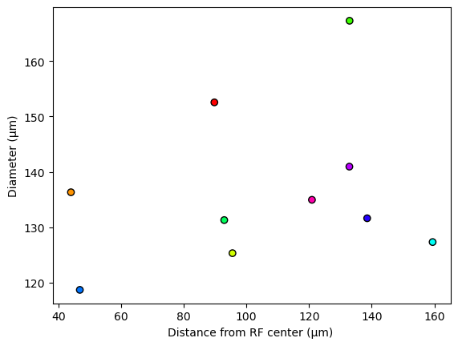

Examples
========

This page will guide through some basic usage examples to illustrate how to use STNMF to obtain subunits from an effective spike-triggered stimulus ensemble (STE).
The examples start from an existing and well-formatted STE of a salamander retinal ganglion cell recorded under spatiotemporal white-noise stimulation. [1]_
The STE has been reduced in its number of spikes here in favor of file size.
For more information on how to prepare the stimulus and spiking response data, see :mod:`stnmf.preprocessing`.

The individual steps can be followed like a tutorial, e.g. by copying the code blocks into a `jupyter notebook <https://jupyter.org>`_.

**Contents**

.. contents::
    :local:
    :depth: 1

.. [1] Gollisch, T., and Liu, J. K. (2018). Data: Salamander retinal ganglion cells under finely structured spatio-temporal white noise [Dataset]. G-Node. https://doi.org/10.12751/g-node.62b65b

Preparation
-----------

The STE that will serve as an exemplary input here will be downloaded and loaded by numpy automatically.

.. code-block:: python

    >>> import numpy as np
    >>> ds = np.DataSource(None)
    >>> ste = np.load(ds.open('https://github.com/gollischlab/STNMF_with_AFHALS/files/13480212/ste.zip', 'rb'))['ste']

The variable `ste` is a :class:`numpy.ndarray` with the following dimensions (x, y, number of spikes).

.. code-block:: python

    >>> ste.shape
    (21, 23, 11409)

Running STNMF
-------------

.. code-block:: python

    >>> from stnmf import STNMF

The STE can now simply be passed to the :class:`STNMF <stnmf.STNMF>` constructor.
However, without specifying further arguments than just providing the STE, the STNMF algorithm will run with the default parameters.
This is not ideal, because sparsity regularization should be adjusted for the cell.
We will have a look at :doc:`../advanced/consensus` later.
For now, we will continue with a suitable sparsity parameter and leave the other optional parameters at their defaults.

.. code-block:: python
    :force:

    >>> stnmf = STNMF(ste, sparsity=1.74)
    Sparse semi-NMF: 100%|████████████████████| 1000/1000 [00:05<00:00, 170.20it/s]

By default, the STNMF algorithm is initialized and run immediately upon constructing the :class:`STNMF <stnmf.STNMF>` object, here stored into the variable `stnmf`.
Depending on the number of pixels (first two dimensions of the STE) and especially the number of the spikes (the last dimension of the STE), STNMF finishes 1000 iterations within a few seconds!

Visualizing the results
-----------------------

We can now illustrate the results of the decomposition with the object method :meth:`STNMF.plot() <stnmf.STNMF.plot>`.

.. note::
    To avoid the warning: ``PixelSizeWarning: No 'pixel_size' set for micrometer conversion!``, we can optionally specify the pixel size of the stimulus on the retina in micrometers (μm). This will display a scale bar in the figure which would otherwise be omitted.

    .. code-block:: python

        >>> stnmf.pixel_size = 30

    Alternatively, we could have specified the pixel size as a parameter when :meth:`constructing <stnmf.STNMF.__init__>` the :class:`STNMF <stnmf.STNMF>` object.

.. code-block:: python

    >>> stnmf.plot()

The animation below illustrates the customizability of the produced figure. The subplots in the bottom are cut off. :doc:`Click here <../advanced/plotting>` to view the full figure.

.. carousel::
    :show_fade:
    :data-bs-keyboard: false
    :data-bs-touch: false
    :data-bs-ride: carousel
    :data-bs-interval: 1000

    .. image:: ../_static/images/example.stnmf.full.png
        :align: center
    .. image:: ../_static/images/example.stnmf.cmap.png
        :align: center
    .. image:: ../_static/images/example.stnmf.colors.png
        :align: center
    .. image:: ../_static/images/example.stnmf.flip.png
        :align: center
    .. image:: ../_static/images/example.stnmf.kwargs.png
        :align: center

This figure summarizes the results in several subplots.

STA
^^^
The top right plot displays an estimate of the receptive field of the cell, as the spike-triggered average (STA) based on the STE.
From the top of the two color bars it is evident that it is an OFF cell.
The receptive field size is indicated by the scale bar to the right of the color bars - only visible if the pixel size was specified.

Modules
^^^^^^^
The bottom color bar corresponds to the modules to the left.
As we kept the default parameters, the STE was decomposed into twenty modules.
They are ordered by their spatial autocorrelation and the STNMF weight from top left to bottom right.
Highly autocorrelated modules are considered localized subunits.
Their subplots are colored consistent with the color coding across the other subplots.

Outlines
^^^^^^^^
Below the STA subplot, the contour outlines of the subunits are overlaid on top of the outline of the STA.
This summarizes the subunit layout with the subunits tiling the receptive field.

Weights
^^^^^^^
.. note::
    This subplot is cut off in the figure shown above, view the full figure :doc:`here <../advanced/plotting>`.

The second of the two factorization matrices of STNMF holds the encodings or weights.
The weights are the coefficients weighting the contribution of each module for a given spike in the STE.
Averaged over all spikes, the weights describe each module's contribution to the spiking response of the cell.
The data points are arranged in the same order and color coding as the modules above.

Autocorrelation
^^^^^^^^^^^^^^^
.. note::
    This subplot is cut off in the figure shown above, view the full figure :doc:`here <../advanced/plotting>`.

The autocorrelation of the spatial modules is depicted as the Moran's I value.
It quantifies how localized each module is to distinguish meaningful subunits from noisy modules.
The data points are arranged in the same order and color coding as the modules above.

.. note::
    Note that the figure is highly customizable. Please refer to :doc:`../advanced/plotting` for more information.

Subunit properties
------------------

Aside from visualizing the factorization result, the :class:`STNMF <stnmf.STNMF>` object exposes many properties for further analysis.
For example, the subunit sizes (diameters) and their distances from the receptive field center are available.

.. code-block:: python

    >>> stnmf.diameters
    array([152.54276 , 136.30772 , 125.30411 , 167.28271 , 131.28024 ,
           127.312515, 118.67331 , 131.6109  , 140.93613 , 134.9421  ],
          dtype=float32)

    >>> stnmf.distances
    array([ 89.77740929,  44.01123582,  95.55239833, 132.91392293,
            92.92400093, 159.41891005,  46.84817263, 138.53156536,
           132.85400828, 120.91474486])

For instance, these can be plotted against each other using :mod:`matplotlib`.
With the help of :mod:`stnmf.plot` we can use the same color coding.

.. code-block:: python

    >>> from stnmf.plot import getcolors
    >>> color_cycler = getcolors('hsv', stnmf.num_subunits)
    >>> colors = color_cycler.by_key()['color']

.. code-block:: python

    >>> from matplotlib import pyplot as plt
    ... plt.scatter(stnmf.distances, stnmf.diameters, c=colors, ec='k')
    ... plt.xlabel('Distance from RF center (μm) ')
    ... plt.ylabel('Diameter (μm)');

Additional STNMF parameters
---------------------------

The above example illustrates the basic usage of STNMF and its results.
In practice, getting an idea of the optional parameters is beneficial for fast and versatile subunit recovery.

Automatic initialization and factorization
^^^^^^^^^^^^^^^^^^^^^^^^^^^^^^^^^^^^^^^^^^

In the examples presented so far, initialization and factorization of STNMF were performed immediately on construction.
Depending on the circumstances, it may be useful to initiate the initialization and factorization manually with additional settings.

Disabling automatic factorization and running it manually afterwards can be achieved with

.. code-block:: python

    >>> stnmf = STNMF(ste, sparsity=1.74, factorize=False)
    >>> stnmf.factorize()

Likewise, the automatic initialization of the modules can be disabled

.. code-block:: python

    >>> stnmf = STNMF(ste, sparsity=1.74, init=None, factorize=False)
    >>> stnmf.init()
    >>> stnmf.factorize()

This allows for more fine-grained control over when to run the STNMF algorithm and how the initialization and factorization are performed with additional parameters.

.. seealso::

    :meth:`STNMF.init() <stnmf.STNMF.init>`
        Initialization method

    :meth:`STNMF.factorize() <stnmf.STNMF.factorize>`
        Factorization method

Keyword arguments
^^^^^^^^^^^^^^^^^

Find a full overview of the available parameters in :meth:`STNMF.__init__() <stnmf.STNMF.__init__>`.

If factorization is performed automatically, that is ``factorize=True``, the parameters of :meth:`STNMF.factorize() <stnmf.STNMF.factorize>` are available on construction as well.

When setting many keyword arguments, it may help readability to store the keyword arguments in a dictionary first.
That also allows to inspect the exact use for reproducibility later.
For example, the parameters are collected here in the Python dictionary `par` that is passed to the STNMF constructor as keyword arguments (kwargs).

.. code-block:: python

    par = dict(
        r=20,
        init='nnsvdlrc',
        sparsity=1.74,
    )

.. code-block:: python

    >>> STNMF(ste, **par)

The same set of parameters can now be applied again for another STE.

.. code-block:: python

    >>> STNMF(ste_2, **par)
